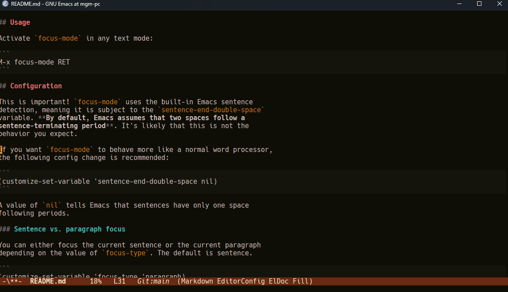

# Focus mode

A minor mode for focused writing. Highlights the sentence at your
cursor so you can better ignore your inner editor and focus on
finishing that first draft.



## Installation

```
M-x package-vc-install https://git.sr.ht/~mgmarlow/focus-mode RET
```

## Usage

Activate `focus-mode` in any text mode:

```
M-x focus-mode RET
```

## Configuration

This is important! `focus-mode` uses the built-in Emacs sentence
detection, meaning it is subject to the `sentence-end-double-space`
variable. **By default, Emacs assumes that two spaces follow a
sentence-terminating period**. It's likely that this is not the
behavior you expect.

If you want `focus-mode` to behave more like a normal word processor,
the following config change is recommended:

```
(customize-set-variable 'sentence-end-double-space nil)
```

A value of `nil` tells Emacs that sentences have only one space
following periods.

### Sentence vs. paragraph focus

You can either focus the current sentence or the current paragraph
depending on the value of `focus-type`. The default is sentence.

```
(customize-set-variable 'focus-type 'paragraph)
```

### Font faces

By default, font faces assume dark mode. The values are plucked from
[ef-themes-autumn](https://git.sr.ht/~protesilaos/ef-themes/tree/main/item/ef-autumn-theme.el#L51-59).
If you use light mode, you will want to customize these faces to suit
your theme.

- `focus-face-main`: Font face for primary, focused text.

- `focus-face-dim`: Font face for background, dimmed text.
